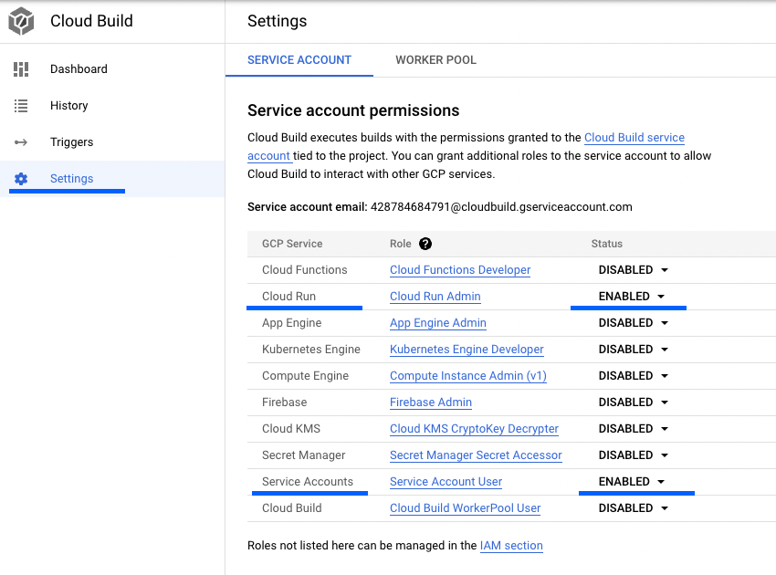

# GCPCloudRunDemo

Es gibt Gelegenheiten, da ist eine oder mehrere serverlose Funktionen nicht
ausreichend, um einen Service darzustellen. Für diese Fälle gibt es auf der
Google Cloud Plattform Google Cloud Run. Cloud Run bietet zwei Möglichkeiten
Container auszuführen. Services und Jobs. In diesem Beispiel wird ein Google
Cloud Run Service mittels Terraform definiert, welcher auf Basis eines
Scheduler Jobs regelmäßig aufgerufen wird. Cloud Build wird dazu genutzt den
aktuellen Code auf den Service zu veröffentlichen.

## tl;dr

Mittel Terraform können alle notwendigen Komponenten erstellt werden, um einen
Cloud Run Services aus einem Github Repository kontinuierlich zu aktualisieren.
Als Beispiel wird ein stark vereinfachter Flask Webservice verwendet. Mittels
Cloud Scheduler wird dieser Service regelmäßig aufgerufen.

## Voraussetzungen

Bevor der Service aufgesetzt werden kann müssen einige Voraussetzungen erfüllt
sein. Es wird ein Google Cloud Project benötigt, sowie ein Github Account. Auf
dem Computer, welcher zur Entwicklung verwendet werden soll, müssen Terraform,
Google Cloud SDK, git, Docker und Python installiert sein. In diesem Beispiel
wird Python verwendet, es ist aber mit jeder Sprache möglich, mit der ein
WebServer erstellt werden kann.

- Ein Google Cloud Projekt kann bei [Google Cloud
  Plattform](https://cloud.google.com) erstellt werden. Es wird nur ein Google
  Account benötigt, Neukunden erhalten ein kostenloses Guthaben von 300€ für 90
  Tage.
- Wenn noch nicht vorhanden sollte ein kostenloser Github Account auf
  [Github](https://github.com) erstellt werden. Das Beispiel kann auch mittels
  Google Cloud Source Repositories umgesetzt werden. Als Alternative zu Cloud
  Build kann Github Actions eingesetzt werden.
- Terraform, Google Cloud SDK, Docker und Python müssen auf dem verwendeten
  Computer installiert werden, hierzu empfiehlt sich ein Paketmanager wie
  Homebrew oder Chocolatey. Linux Nutzer verwenden am besten den in ihrer
  Distribution mitgelieferten.
- Soll nichts installiert werden, dann kann auch die Google Cloud Shell
  verwendet werden, diese findet sich im in der [Cloud
  Console](https://console.cloud.google.com)

### APIs die in Google Cloud aktiviert werden müssen

Neben den Voraussetzungen zur Software müssen auf der Google Cloud Plattform
einige APIs aktiviert werden: 

- Cloud Run API
- Cloud Build API
- Artifact Registry API
- Cloud Scheduler API
- Cloud Logging API
- Identity and Access Management API

Die Cloud Run API wird benötigt um einen Cloud Run Service zu erstellen, die
Artifact Registry wird benötigt, um die Container Abbilder zu speichern. Die
Cloud Build API und die Identity and Access Management API werden benötigt, um
eine CI/CD Pipeline zu implementieren. Cloud Scheduler wird in diesem Beispiel
verwendet um den Service regelmäßig aufzurufen. Da alle Services via Terraform
erstellt und verwaltet werden, werden die APIs benötigt.

## Infrastruktur

Das Erstellen der Infrastruktur läuft in mehreren Schritten ab, nur wenn App Code und Container bereits vorhanden sind, kann der gesamte Prozess automatisiert werden. Für die Definition der Infrastruktur wird ein Ordner Infrastructure erstellt und darin die Dateien `main.tf`, `variables.tf`und terraform.tfvars`

```Shell
mkdir Infrastructure
cd Infrastructure
touch main.tf
touch terraform.tfvars
```

Insgesamt werden vier Komponenten erstellt, das Artifact Registry Repository, ein Cloud Run Service, ein Cloud Build Trigger und ein Cloud Scheduler Job. Bevor die eigentliche Infrastruktur erzeugt werden kann müssen einige Service Accounts definiert werden. Ziel ist es, das jedes Asset eine eigene Identität zugewiesen werden kann. Daher werden drei Service Accounts erstellt, für den Run Service, den Build Trigger und den Scheduler Job.

```terraform
resource "google_service_account" "cloud_run_demo_sa" {
  project      = var.project_name
  account_id   = "cloudrundemosa"
  description  = "Running Cloud Run Scheduled Job to update data in BigQuery under this account"
  display_name = "Cloud Run Demo Service Account"
}
# Service account for scheduler to call the function
resource "google_service_account" "cloud_shedule_caller" {
  project      = var.project_name
  account_id   = "cloudscheduler"
  description  = "A service account to run the scheduler under an invoke the cloud run service"
  display_name = "Cloud Scheduler Demo User"
}

# Service Account to run the cloud build trigger
resource "google_service_account" "cloud_run_demo_builder" {
  project      = var.project_name
  account_id   = "cloudrundemobuilder"
  description  = "A service account to run the cloud build trigger"
  display_name = "Cloud Run Demo Build Trigger"
}
```

Da der erste Schritt die Einrichtung der Artifact Registry für den Cloud Run Service ist, wird dieser wie folgt hinzugefügt:

```terraform
resource "google_artifact_registry_repository" "container_demo_repo" {
  location      = var.location
  project       = var.project_name
  repository_id = var.container_name
  description   = "Demo docker repository"
  format        = "DOCKER"
}

// create the url of a container in the registry, by name of container
data "google_container_registry_image" "demo_container" {
  name    = var.container_name
  project = var.project_name
}
````

Nun kann der erste Schritt zum Aufsetzen der Infrastruktur mittels des Terraform Dreiklangs durchgeführt werden:

```shell
# initialize the terraform project
terraform init
# check if everything will go as planned
terraform plan
# create the infrastructure
terraform apply
````

## Die Beispiel Flask Anwendung

Als Beispielanwendung wird hier eine sehr simple flask Webapp verwendet. Die Webapp beinhaltet eine einzige Route, es wird `Hello World` bei einem `GET` Request zurück gegeben, und mittels `POST` kann die Nachricht personalisiert werden. Die Anwendung dient nur der Demonstration, es können fast beliebige Funktionalitäten umgesetzt werden. 

Es ist auch nur zwingend notwendig flask oder Python zu verwenden, es kann jede Sprache und jedes Framework eingesetzt werden, welches einen Webserver implementieren kann und auf HTTP Anfragen reagieren kann. Flask selbst ist ein sogenanntes Micro Framework und kann flexibel eingesetzt werden, für mehr Informationen empfiehlt sich z.b. das [Flask Mega Tutorial](https://blog.miguelgrinberg.com/post/the-flask-mega-tutorial-part-i-hello-world)

Im Projektverzeichnis muss ein neuer Ordner `App` erzeugt werden, in diesem Ordner wird die Python Datei `main.py`, sowie die [requirements.txt](./App/requirements.txt) Datei erzeugt.

```python
from flask import Flask, request


app = Flask(__name__)


@app.route('/', methods=['GET', 'POST'])
def main():
    if request.method == 'POST':
        # get some incomming data
        data = request.get_json()
        # This would be the place where could call your code to run.
        # But that wouldn't be a good idea.
        # Therefore we create a script package, register the scripts and run
        # them all in here
        return f"Hello {data['name']}"
    return "Hello World"


if __name__ == '__main__':
    """
    Creating a very basic debug app. Don't use this in production
    """
    app.run(
        debug=True,
        port=8000,
        host="0.0.0.0"
    )
```

Dieser minimale Webservice kann local ausgeführt werden indem ein virtual environment erzeugt und die in [requirements.txt](./App/requirements.txt) spezifizierten Pakete installiert werden.

```Shell
# create a virtual environment
python -m venv venv
# activate it
source venv/bin/activate
# install required packages
pip install -r requirements.txt
```

Die App kann nun local ausgeführt werden mittels:

```Shell
python main.py
```

Zum Testen kann im Browser die Adresse [localhost:8080](http://localhost:8080) aufgerufen werden oder mittels curl ein `POST` Request an den Service gesendet werden.

```Shell
curl -X POST -H "Content-Type: application/json" \
    -d '{"name": "FooBar"}' \
    http://localhost:8080
```

Der mit flask mitgelieferte Web Server sollte nur zu Entwicklungszwecken verwendet werden, in produktiven Umgebungen kann z.b. *gunicorn* eingesetzt werden. Gunicorn wird in diesem Beispiel später auch im Container verwendet werden.

```Shell
gunicorn --bind 0.0.0.0:8080 --workers 1 main:app
```

## Docker Container erstellen, ausführen und deployen

Um einen Service in Cloud Run auszuführen muss dieser in einem Docker Container vorliegen. Dazu wird zunächst ein [Dockerfile](./App/Dockerfile) im App Ordner erstellt. Diese ist einfach gehalten, es basiert auf einem Python Container, kopiert die Dateien aus dem App Ordner und definiert das Start Kommando für `Gunicorn`

In vielen Fällen sind im lokalen Entwicklungsordner Dateien vorhanden die nicht in den Container veröffentlicht werden sollten, damit Dateien explizit aus der Containererzeugung ausgeschlossen werden können kann eine [.dockerignore](./App/.dockerignore) Datei hinzugefügt werden. Diese funktioniert analog der `.gitignore` Dateien.

Um das Veröffentlichen auf die Artifact Registry zu vereinfachen, kann es eine gute Idee sein dem Namensschema der Registry zu folgen: *location—docker.pkg.dev/your-project-id/registryname/containername:latest*. Mittels `docker build` kann das Container Image erstellt werden:

```Shell
docker build -t LOCATION-docker-pkg.dev/your-project-name/democontainer/democontainer:latest .
```

Um das erstellt Image local zu testen kann dieses mittels `docker run` auch lokal ausgeführt werden. Wichtig ist dabei zu beachten die notwendigen Umgebungsvariablen mit zugeben und den Port zu exponieren.

```bash
docker run -e PORT=8080 -p 8080:8080 <image_id>
```

> Werden im Webservice Google Identitäten verwendet, dann müssen Informationen über den zu verwendenden Google Account mitgegeben werden. Wie dies im Detail funktioniert findet sich unter [Cloud Run lokal testen](https://cloud.google.com/run/docs/testing/local?hl=de#docker-with-gcp-access)

### Den ersten Container manuell deployen

Bevor es möglich ist den Cloud Run Service zu erstellen muss das Container Abbild einmal manuell in die Artifact Registry veröffentlicht werden.

```Shell
docker push europe-west3-docker.pkg.dev/snappy-nature-350016/democontainer/democontainer:latest
```

> Erstellen und veröffentlichen des Container Abbilds kann auch in einem Kommando erfolgen:
>
> ```Shell
> docker buildx build -t name_of_image —push -f Dockerfile
> ````

## Cloud Run Service aufsetzen

Da der initiale Container nun in der Aritfact Registry vorhanden ist, kann der Cloud Run Service daraus erstellt werden. Für den Cloud Run Service wird eine neue Resource im `main.tf` erstellt.

```terraform
resource "google_cloud_run_service" "cloud_run_demo" {
  project  = var.project_name
  name     = var.RunJobName
  location = var.location

  template {
    spec {
      containers {
        image = "europe-west3-docker.pkg.dev/${var.project_name}/${var.container_name}/${var.container_name}:latest"
      }
    }
  }

  traffic {
    percent         = 100
    latest_revision = true
  }

}

# A Schedule to run the job on
resource "google_cloud_scheduler_job" "timer_trigger" {
  name             = "scheduled-cloud-run-job"
  project          = var.project_name
  description      = "Invoke a Cloud Run container on a schedule."
  schedule         = "*/8 * * * *"
  time_zone        = "Europe/Berlin"
  attempt_deadline = "320s"

  retry_config {
    retry_count = 2
  }

  http_target {
    http_method = "POST"
    uri         = google_cloud_run_service.cloud_run_demo.status[0].url

    oidc_token {
      service_account_email = google_service_account.cloud_shedule_caller.email
    }
  }
}
```

Dieser Service ist zunächst privat, alle Identitäten die diesen Service aufrufen wollen benötigen die Rolle `roles/run.invoker`. Da der Cloud Scheduler den Service regelmäßig aufrufen soll, muss die Identität des Schedulers Mitglied der Rolle sein.

```terraform 
# allow shedule to run the cloud run service
resource "google_cloud_run_service_iam_binding" "invoker" {
  location = var.location
  project  = var.project_name
  service  = google_cloud_run_service.cloud_run_demo.name
  role     = "roles/run.invoker"
  members = [
    "user:${var.service_owner}",
    "serviceAccount:${google_service_account.cloud_shedule_caller.email}"
  ]
}
```

Nun kann der Terraform Dreiklang verwendet werden den Service und den Scheduler Job zu erstellen.

## Cloud Build Trigger erstellen

Der finale Schritt um ein kontinuierliches deployment des Services zu erreichen ist einen Cloud Build Trigger einzurichten. Der Cloud Build Trigger beobachtet Veränderungen am GitHub Repository und erstellt bei jedem neuen Commit auf dem main branch eine neue Version des Cloud Run Services. Die hier vorgestellte Pipeline beinhaltet nur das Erstellen und Veröffentlichen des Containers. Für eine produktive Implementation ist unbedingt zu empfehlen auch noch ein Testschritt mit einzufügen. Mit dem folgenden Code wird der Trigger mittels Terraform erstellt:

```terraform
resource "google_cloudbuild_trigger" "demo_cloud_build" {
  name            = "CloudRundDemo"
  project         = var.project_name
  description     = "Triggers a new cloud run image to be build, when new code is published"
  service_account = google_service_account.cloud_run_demo_builder.id
  github {
    owner = "fingineering"
    name  = "GCPCloudRunDemo"
    push {
      branch = "main"
    }
  }
  filename = "cloudbuild.yaml"

  substitutions = {
    "_REPO"         = var.container_name
    "_IMAGE_NAME"   = var.container_name
    "_LOCATION"     = var.location
    "_SERVICE_NAME" = google_cloud_run_service.cloud_run_demo.name
  }
}

# IAM Binding for Cloud Run
# Allow Cloud Build to edit the cloud run service
resource "google_cloud_run_service_iam_member" "triggerRunServiceDeveloper" {
  location = var.location
  project  = var.project_name
  service  = google_cloud_run_service.cloud_run_demo.name
  role     = "roles/run.admin"
  member   = "serviceAccount:${google_service_account.cloud_run_demo_builder.email}"
}
```

Der Cloud Build Trigger nutzt zur Definition des Deployment Processes die Datei `cloudbuild.yaml`, diese enthält die drei Schritte zum Erstellen des Container Abbilds, Veröffentlichen des Abbilds und Erzeugen einer neuen Version des Cloud Run Services

```yaml
steps:
# build step
- name: 'gcr.io/cloud-builders/docker'
  args: [ 'build', '-t', '$_LOCATION-docker.pkg.dev/$PROJECT_ID/$_REPO/$_IMAGE_NAME:latest', './App' ]
# push to artifact registry
- name: 'gcr.io/cloud-builders/docker'
  args: ['push', '$_LOCATION-docker.pkg.dev/$PROJECT_ID/$_REPO/$_IMAGE_NAME:latest']
# Deploy Container to Cloud Run
- name: 'gcr.io/google.com/cloudsdktool/cloud-sdk'
  entrypoint: gcloud
  args: ['run', 'deploy', '$_SERVICE_NAME', '--image', '$_LOCATION-docker.pkg.dev/$PROJECT_ID/$_REPO/$_IMAGE_NAME:latest', '--region', '$_LOCATION']
images:
- '$_LOCATION-docker.pkg.dev/$PROJECT_ID/$_REPO/$_IMAGE_NAME:latest'
options:
  logging: CLOUD_LOGGING_ONLY
```

1. Erstellen des Container Abbilds mittels des Docker build Tools. Das erste Argument ist die Aktion `build`, das zweite und dritte beziehen sich auf den Tag des Images und das vierte gibt den Ort vor an dem nach dem Dockerfile gesucht wird
2. Veröffentlichen des Container Images in die Artifact Registry mittels des Cloud Build Docker Tools. Als Argumente werden die Aktion `push` und das Ziel mitgegeben.
3. Veröffentlichen der neuen Version des Images im Cloud Run Service mittels des Google Cloud SDK Tools `gcloud`

Alle drei Schritte nutzen Variablen, um Projektziel, Image Tag und Ort flexibel durch den Build Trigger zu steuern. Diese Variable werden bei der Erstellung des Triggers mit definiert, d.h. dieser finden sich in der Definition des Cloud Build Triggers in der Terraform Datei. Die Variablen werden *substitutions* genannt, es ist zu beachten, das nutzerdefinierte Variablen mit einem Unterstrich beginnen müssen, nur Systemvariablen, wie die `PROJECT_ID`

Das Erstellen des Cloud Build Triggers kann versagen, in diesem Falle sollten die Einstellungen von Cloud Build in der Cloud Console geprüft werden. Die Service Account Berechtigungen für Cloud Run und Service Accounts müssen aktiviert sein, wie im Bild unten.



## Zusammenfassung

Mit Hilfe von Terraform ist es möglich ein vollständig in Code definierten, kontinuierlich veröffentlichten Google Cloud Run Service zu erstellen. Dazu werden GCP Services verwendet, eine Flask Webapp in einem Container zu verpacken und diesen auf Cloud Run zu veröffentlichen.

Für Fragen erstellt gerne ein Issue oder ihr findet mich auf [LinkedIn](https://www.linkedin.com/in/owilke/)

Wenn diese Anleitung hilfreich für euch war, lasst doch gerne ein Kommentar, einen Stern oder einen Kaffee da:

[](https://www.buymeacoffee.com/owil)

## Quellen
- [Terraform Cloud Build Registry](https://registry.terraform.io/providers/hashicorp/google/latest/docs/resources/cloudbuild_trigger)
- [Dokumentation des Deployments](https://cloud.google.com/build/docs/deploying-builds/deploy-cloud-run)
- [Terraform 101](https://github.com/fingineering/terraform-101)
- [Was ist Cloud Run](https://cloud.google.com/run/docs/overview/what-is-cloud-run)
- [Flask Mega Tutorial](https://blog.miguelgrinberg.com/post/the-flask-mega-tutorial-part-i-hello-world)
